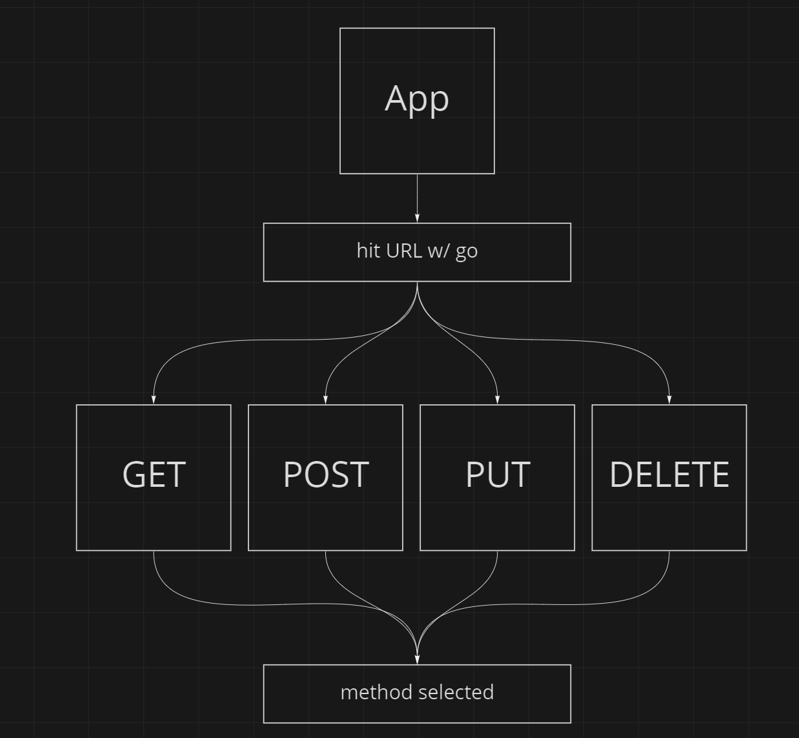

# RESTy lab

## Lab 26 Requirement

Refactor the RESTy application as follows:

1. Convert all child components of App.js from classes to functions
The App component serves as the container for all sub-components of this application.
Leave this component as a Class.
Make sure all base styles for App are included in a .scss imported within App.js.
Ensure that the Header, Footer, Results and Form components are imported using ES6 import syntax.

2. Use .scss files to style each component
Each of the components use their own .scss file for styling.

3. Core application functionality should remain unchanged:
The Form component should:
Call a function on submit that updates the App component via a function sent down as a prop so that the app can process the form values.
The Results component should show mock API results.

## UML

## Lab 27 requirement

- Refactor any components using this.setState to implement the useState react API hook.
- Refactor the Form Component to implement user input from form elements, instead of hard coded - string values.

